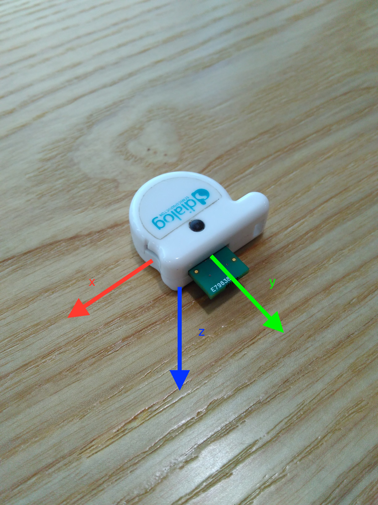
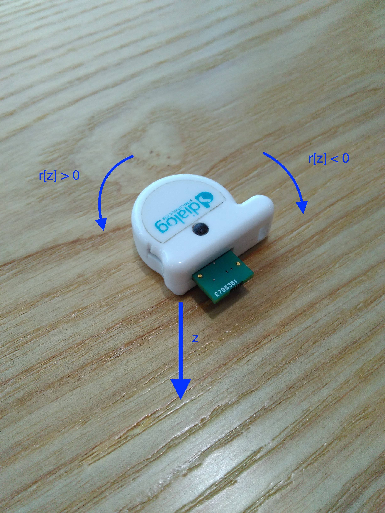

# Dialog IoT Sensor Kit

## 概述

Dialog IoT Sensor Kit是Dialog Semiconductor推出的传感器应用开发套件, 其中包含一个惯性测量传感器（加速度和角速度），一个磁力计和一个环境传感器（温度、温度、气压）。在[官网链接](http://www.dialog-semiconductor.com/iotsensor)中有更加详细的介绍。  
在Evothings项目中有一个关于此设备的[开源APP](https://evothings.com/dialog-iot-sensor-starter-guide/)，用JavaScript写成，我们在一开始接触这款设备时参考了这个APP。  

## 数据交互

服务UUID: 2ea78970-7d44-44bb-b097-26183f402400，以下讨论的所有特征都是这个服务之下的。

1. 读设备信息

    读特征【2ea78970-7d44-44bb-b097-26183f402408】，返回信息中包含传感器可用性和固件版本号：

    Byte0|Byte1|Byte2|Byte3|Byte4|Byte5|Byte6|Byte7至结尾
    -----|-----|-----|-----|-----|-----|-----|-----
    加速度计|陀螺仪|磁力计|气压计|温度计|湿度计|SFL|固件版本号，ASCII字符串

    Bytes 0~6表示对应传感器是否可用 (1: 可用, 0: 不可用)，但如果Byte6（SFL）为1，那么加速度计、陀螺仪、磁力计都可用，即使它们对应的字节是0。

1. 收发控制命令

    向特征【2ea78970-7d44-44bb-b097-26183f402409】写入一个字节，即可执行相应的控制命令。  
    打开特征【2ea78970-7d44-44bb-b097-26183f40240A】的通知，接收控制命令的回应，回应数据的格式如下：

    Byte0|Byte1|Byte2至结尾
    -----|-----|-----
    固定为0x08|控制命令|数据内容

    常用的控制命令及回应数据：
    
    控制命令|含义|回应数据
    ------|----|------
    0|停止传感器（所有传感器的总开关）|0x 08 00 00
    1|启动传感器（所有传感器的总开关）|0x 08 01 01
    6|查询传感器运行状态|0x 08 06 00 - 停止，0x 08 06 01 - 启动
    11(0x0B)|查询设置信息|回应数据见下
    
    查询设置信息的回应数据：
    
    字节|含义
    -----|-----
    Byte0|固定值0x08
    Byte1|控制命令0x0B
    Byte2|传感器组合设置
    Byte3|加速度计取值范围
    Byte4|加速度计频率
    Byte5|陀螺仪取值范围
    Byte6|陀螺仪频率
    Byte7|磁力计频率
    Byte8|环境传感器频率
    Byte9|传感器融合频率
    Byte10|传感器融合原始数据使能
    Byte11|校准模式
    Byte12|自动校准模式

1. 接收传感器数据

    为接收传感器数据，需要确保传感器开启——写控制命令1打开总开关，然后使能传感器对应特征的通知。  
    通知数据的格式：

    Byte0|Byte1|Byte2|Byte3至结尾
    -----|-----|-----|-----
    传感器ID|固定为0x02|固定为0x03|数值

    其中数值从字节3开始，每个数值包含2或4个字节（低字节在前，有符号），数值的个数用维度表示（比如三轴加速度计包含X、Y、Z三个方向的数值，维度即为3）：

    * 加速度计 ACCELEROMETER
        * 传感器ID: 1
        * 特征UUID: 2ea78970-7d44-44bb-b097-26183f402401
        * 字节数: 2
        * 维度: 3
        * 单位: g

        返回值应当根据加速度计的取值范围除一个系数（取值范围来自控制命令11的回应）：

        取值范围参数|实际取值范围|系数
        -----|-----|-----
        3|±2g|16384
        5|±4g|8192
        8|±8g|4096
        12|±16g|2048

    * 陀螺仪 GYROSCOPE
        * 传感器ID: 2
        * 特征UUID: 2ea78970-7d44-44bb-b097-26183f402402
        * 字节数: 2
        * 维度: 3
        * 单位:  deg/s

        返回值应当根据陀螺仪的取值范围除一个系数（取值范围来自控制命令11的回应）：

        取值范围参数|实际取值范围|系数
        -----|-----|-----
        0|±2000 deg/s|16.4
        1|±1000 deg/s|32.8
        2|±500 deg/s|65.6
        3|±250 deg/s|131.2
        4|±125 deg/s|262.4

    * 磁力计 MAGNETOMETER
        * 传感器ID: 3
        * 特征UUID: 2ea78970-7d44-44bb-b097-26183f402403
        * 字节数: 2
        * 维度: 3
        * 单位: uT

    * 气压计 BAROMETER
        * 传感器ID: 4
        * 特征UUID: 2ea78970-7d44-44bb-b097-26183f402404
        * 字节数: 4
        * 维度: 1
        * 单位: Pa

    * 湿度 HUMIDITY
        * 传感器ID: 5
        * 特征UUID: 2ea78970-7d44-44bb-b097-26183f402405
        * 字节数: 4
        * 维度: 1
        * 单位: %（将返回值除以1024）

    * 温度 TEMPERATURE
        * 传感器ID: 6
        * 特征UUID: 2ea78970-7d44-44bb-b097-26183f402406
        * 字节数: 4
        * 维度: 1
        * 单位: °C（将返回值除以100）

    * 传感器融合 (Sensor Fusion)
        * 传感器ID: 7
        * 特征UUID: 2ea78970-7d44-44bb-b097-26183f402407
        * 字节数: 2
        * 维度: 4（顺序为w、x、y、z，将返回值除以32768，结果介于[-1,1]之间）

## 数据解读

1. 加速度计

    下图展示了X、Y、Z相对于设备的方向。
    将设备平放在桌面上，有LED的一侧朝上，Z轴正方向所指与重力加度一致（即此时加速度Z方向的分量为1）
    如果将设备竖起来放，就像一个小写的字母d，那么加速度的x分量为1。  
    

1. 陀螺仪

    陀螺仪用于测量设备旋转的速度。
    看向LED所在的一侧，这正是z轴的方向，现在当设备按顺时针方向旋转时，陀螺仪数值的z分量将为负值。
    陀螺仪数值的单位是度/秒，即每秒旋转多少度。
    

1. 传感器融合

    传感器融合指设备用内置算法，根据加速度计、陀螺仪和磁力计的数据计算设备的实时姿态，用四元数 w + xi + yj +zk 表示。关于四元数的详细解释，请参考：[四元數與旋轉](https://openhome.cc/Gossip/ComputerGraphics/QuaternionsRotate.htm)。
